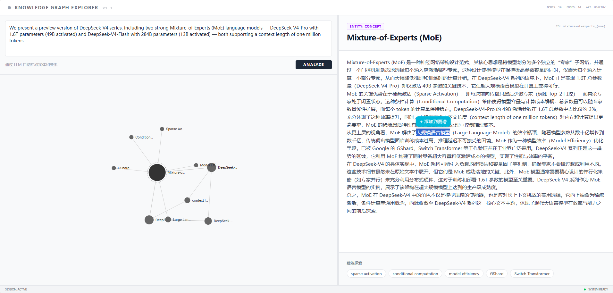

# Knowledge Graph Explorer

Visualize and explore relationships between entities hidden in text using AI-powered graph extraction.




## Features

- **AI Entity Extraction** — Submit any text and let the LLM identify entities (domain, problem, concept, mechanism, etc.) and their relationships, streamed in real time via SSE
- **Interactive D3 Graph** — Drag, zoom, and hover to explore the knowledge graph; Morandi color palette with semantic label scaling
- **Deep Dive Expansion** — Click any node to expand it with SSE streaming analysis, discovering new related entities and suggested explorations
- **Split-Pane Layout** — Resizable left (input + graph) and right (analysis) panels with drag divider
- **Text-to-Entity** — Select any text in the analysis panel and add it directly to the graph
- **Settings Panel** — Slide-over drawer to configure API Key, Base URL, model, and all generation parameters at runtime
- **Provider Presets** — Auto-detects DeepSeek / Qwen from model name and applies sensible defaults (max_tokens, temperature, thinking mode)
- **Model List** — Fetch available models from the API and select with one click
- **LaTeX Math Rendering** — Inline and block math formulas rendered with KaTeX in analysis output

## Tech Stack

| Layer | Technology |
|-------|-----------|
| Frontend | React 19, TypeScript, D3.js 7, Tailwind CSS 4 |
| Backend | Express 4, Vite (dev server + middleware) |
| AI | OpenAI API (or compatible endpoint), SSE streaming |
| Markdown | react-markdown + remark-math + rehype-katex |
| Icons | Lucide React |

## Quick Start

**Prerequisites:** Node.js 18+

```bash
# 1. Clone the repository
git clone https://github.com/ksufer/knowledge-graph-explorer.git
cd knowledge-graph-explorer

# 2. Install dependencies
npm install

# 3. Configure environment variables
cp .env.example .env
# Edit .env and set your OPENAI_API_KEY (and optionally OPENAI_BASE_URL / OPENAI_MODEL)

# 4. Start the dev server
npm run dev
```

The app runs at `http://localhost:3000`. API Key, Base URL, and all model parameters can also be configured at runtime via the Settings panel (gear icon in the header).

## Project Structure

```
knowledge-graph-explorer/
├── src/
│   ├── App.tsx                      # Root component — layout, state, API orchestration
│   ├── main.tsx                     # React entry point
│   ├── index.css                    # Tailwind CSS v4 import
│   ├── components/
│   │   ├── TextInput.tsx            # Text submission form
│   │   ├── KnowledgeGraph.tsx       # D3.js force-directed graph
│   │   ├── AnalysisPanel.tsx        # Entity analysis + markdown + math rendering
│   │   └── SettingsPanel.tsx        # Runtime model settings panel
│   ├── lib/
│   │   └── graphUtils.ts            # mergeGraphData — deduplication logic
│   └── types/
│       └── index.ts                 # TypeScript type definitions
├── server.ts                        # Express server + API routes + Vite middleware
├── presets.ts                       # Provider presets (DeepSeek, Qwen)
├── prompts/                         # LLM prompts (hot-reloading)
│   ├── loader.ts                    # Prompt loader with mtime cache
│   ├── analyze/                     # Entity extraction prompts
│   └── expand/                      # Entity expansion prompts
├── vite.config.ts                   # Vite configuration
├── tsconfig.json                    # TypeScript configuration
└── package.json
```

## API Endpoints

### `POST /api/analyze`

Analyzes text with SSE streaming. Returns summary, entities, and relations.

**Request:** `{ "text": "..." }`
**Response:** SSE stream with `chunk` (streaming summary), `thinking` (reasoning tokens), and `done` (final entities + relations + summary) events.

### `POST /api/expand`

Expands a single entity with SSE streaming. Returns detailed analysis, new entities, new relations, and suggested explorations.

**Request:** `{ "entity": {...}, "existingEntities": [...], "originalText": "..." }`
**Response:** SSE stream with `chunk` (streaming analysis), `thinking` (reasoning tokens), and `done` (final newEntities + newRelations + analysis + suggestedExplorations) events.

### `GET /api/settings`

Returns current model configuration (API key redacted).

### `POST /api/settings`

Updates model configuration at runtime. If model matches a known provider (DeepSeek / Qwen), preset defaults are auto-applied.

### `POST /api/settings/test`

Tests API connectivity with current configuration. Returns `{ ok: true, model: "..." }` on success.

### `GET /api/models`

Lists available models from the configured API endpoint.

## Environment Variables

| Variable | Required | Default | Description |
|----------|----------|---------|-------------|
| `OPENAI_API_KEY` | No | — | OpenAI API key (can be set via Settings panel at runtime) |
| `OPENAI_BASE_URL` | No | `https://api.openai.com/v1` | Compatible API endpoint |
| `OPENAI_MODEL` | No | `gpt-3.5-turbo` | Model to use for extraction |

## Supported Providers

| Provider | Models | Notes |
|----------|--------|-------|
| DeepSeek | `deepseek-v4-pro`, `deepseek-chat`, etc. | Thinking mode via top-level `thinking` param; `presence_penalty` hidden |
| Qwen | `qwen/qwen3.6-*`, etc. | Thinking disable via `chat_template_kwargs`; `reasoning_effort` hidden |
| OpenAI | `gpt-4o`, `gpt-3.5-turbo`, etc. | All parameters visible |

Extend by adding entries to `presets.ts`.
